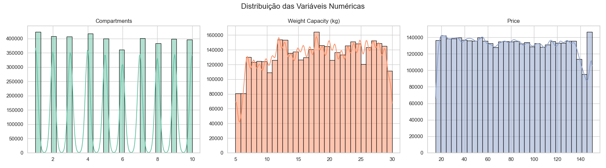
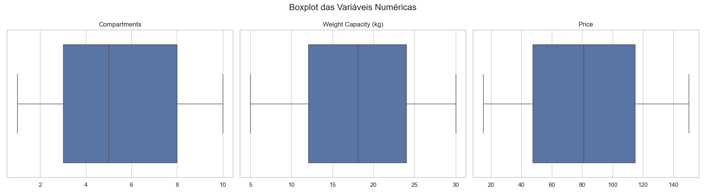
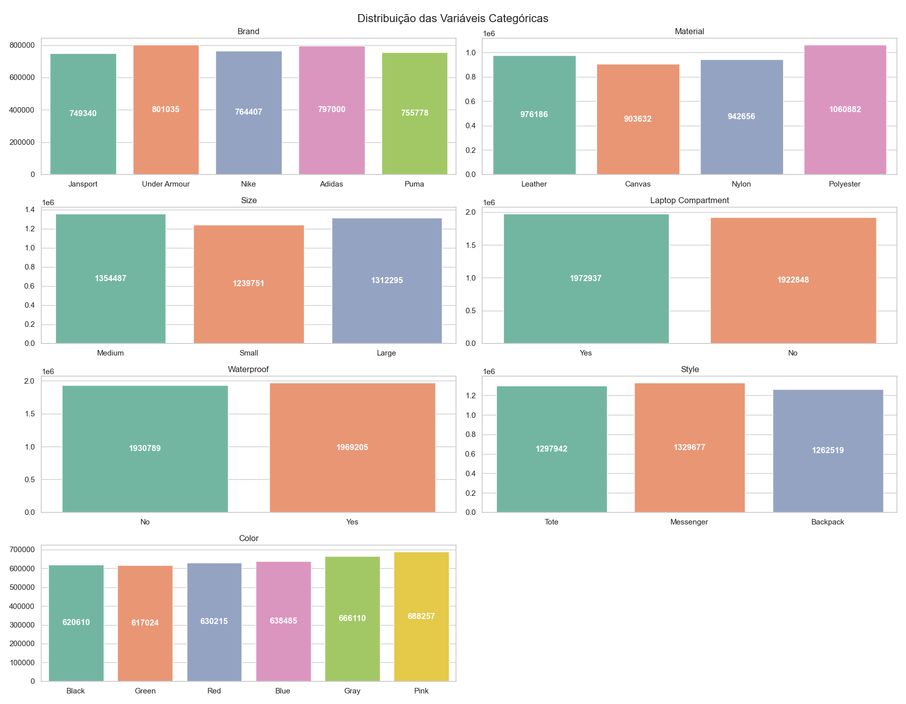
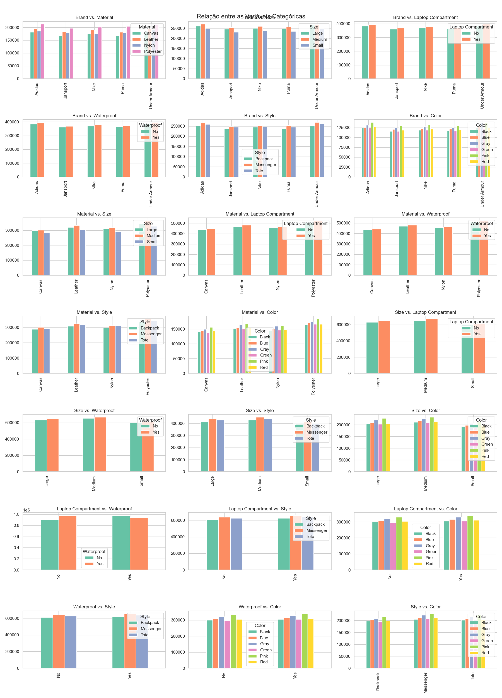
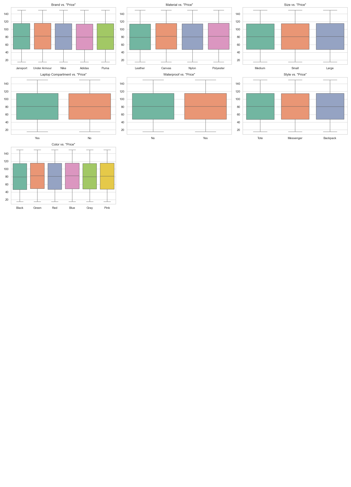
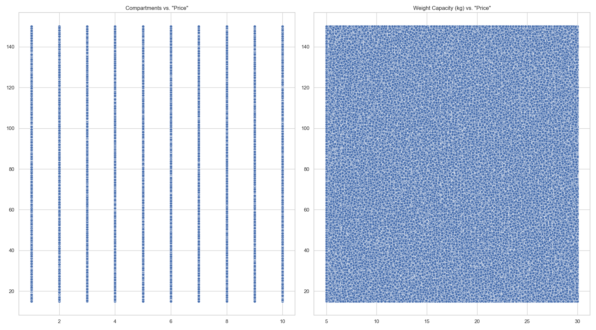

# RELATÓRIO FINAL: SPACESHIP TITANIC COMPETITION
### Autor: Juliano Orlandi
 
 

---
### **Índice**
#### [1. Introdução](#1-introdução)
#### [2. Preparação dos Dados](#2-preparação-dos-dados)
- #### [Coleta dos Dados](#21-coleta-dos-dados)
- #### [Análise Exploratória](#22-análise-exploratória)
- #### [Pré-processamento dos Dados](#23-pré-processamento-dos-dados)
- #### [Engenharia de Atributos](#24-engenharia-de-atributos)
- #### [Seleção de Atributos](#25-seleção-de-atributos)
#### [3. Modelagem](#3-modelagem-1)
- #### [Treinamento de Modelo](#31-treinamento-do-modelo)
- #### [Avaliação](#32-avaliação)
- #### [Otimização de Hiperparâmetros](#33-otimização-de-hiperparâmetros)
#### [4. Submissão](#4-submissão)
- #### [Predição para submissão](#41-predição-para-submissão)
#### [5. Conclusão](#5-conclusão)

 

---
### **1. Introdução**
Este projeto foi desenvolvido com o intuito de aprendizado e desenvolvimento de 
técnicas área de *machine learning*. Trata-se, na verdade, de um desafio educacional 
proposto pela plataforma *Kaggle*. A página inicial da competição pode ser acessada 
[aqui](https://www.kaggle.com/competitions/playground-series-s5e2). A ideia central era praticar
os conhecimentos de *machine Learning* de tal modo que fosse possível comparar o meu trabalho 
com o trabalho de outras pessoas. Minha expectativa era poder me beneficiar do conhecimento e 
da experiência da comunidade de cientistas de dados e, quem sabe, fazer alguma contribuição 
também. 

O objetivo do desafio é prever os preços de mochilas com base em atributos como cor, estilo, tamanho, número de compartimentos, etc. Trata-se, portanto, de um problema de regressão.

 

---
### **2. Preparação dos Dados**
#### **2.1. Coleta dos Dados**
Os dados foram fornecidos pela plataforma *Kaggle* e se encontram em quatro arquivos: 
[train.csv](data/train.csv), [training_extra.csv](data/training_extra.csv), [test.csv](data/test.csv) e 
[sample_submission.csv](data/sample_submission.csv). O primeiro é o *dataset* a ser utilizado 
para o treinamento do modelo. O segundo é um conjunto muiot maior de dados que também pode ser utilizado para o treinamento do modelo. O terceiro é o arquivo com os dados para fazer as previsões. E o 
quarto é um exemplo de como deve ser a saída do sistema e do que deve ser postado na 
plataforma para fins de avaliação. Mais informações sobre os arquivos pode ser encontradas 
[aqui](https://www.kaggle.com/competitions/playground-series-s5e2/data). 

#### **2.2. Análise Exploratória**

O *dataset* de treino concatenado com o *dataset* extra possui 3994318 linhas e 10 colunas. A última coluna, *"Price"*, é o 
*target* do projeto. Segue abaixo um resumo dos atributos por tipo de dado, dtype e número de valores faltantes.

|                           | Tipo de dado | dtype   | Número de valores faltantes |
|---------------------------|--------------|---------|-----------------------------|
| **Brand**                 | Categórico   | object  | 126758
| **Material**              | Categórico   | object  | 110962
| **Size**                  | Categórico   | object  | 87785
| **Compartments**          | Numérico     | float64 | 0
| **Laptop Compartment**    | Categórico   | object  | 98533
| **Waterproof**            | Categórico   | object  | 94324
| **Style**                 | Categórico   | object  | 104180
| **Color**                 | Categórico   | object  | 133617
| **Weight Capacity (kg)**  | Numérico     | float64 | 1808

 

Das **variáveis numéricas**, apenas *"Compartments"* é discreta. Nenhuma delas possui *outliers* nem distribuição normal conforme pode ser observado nos gráficos abaixo.

 

 

Em relação às **variáveis categóricas**, elas possuem distribuição balanceada. Os gráficos que mostram as relações entre elas não parece indicar qualquer relação de dependência entre elas.

 

 

Em relação ao *target*, *"Price"*, a comparação com as variáveis categóricas novamente indica que não há dependência. Os gráficos de *boxplot* indicam que a mediana e os quartis se mantém mais ou menos os mesmos para todas as categorias de cada variável.

A relação entre o *target* e as variáveis numéricas também indica  que não há dependência;

---

#### **2.3. Pré-processamento dos Dados**

O pré-processamento dos dados é executado numa função chamada ***"pre_processing()"***. Em primeiro lugar, ela transforma *"Compartments"* numa variável categórica, uma vez que seus valores são discretos e representam muito mais um *tipo* de mochila do que propriamente uma característica mensurável. Em outras palavras, como se pode observar na relação entre *"Compartments"* e as demais variáveis, ter 1 ou 10 compartimentos não influencia o tamanho da mochila nem sua capacidade em kg. Se *"Comprtments"* fosse tratado como numérico, a diferença entre seus valores influenciaria os modelos de aprendizagem de máquina.

A segunda etapa de ***"pre_processing()"*** lida com os valores faltantes das colunas categóricas. Como não há aparentemente relações de dependência entre as variáveis, optei por preencher os valores faltantes de forma aleatória, respeitando porém sua distribuição original. Se, portanto, uma determinada variável possuía uma distribuição de 34%, 34% e 32% para as categorias A, B e C, os valores faltantes foram preenchidos aleatoriamente com 34% da categoria A, 34% da categoria B e 32% da categoria C.

A terceira etapa de ***"pre_processing()"*** preenche os valores de *"Weight Capacity (kg)"* com a média. Novamente, a comparação com as demais variáveis não indicou qualquer relação que pudesse ser utilizada para orientar o preenchimento.

Por fim, a função ***"pre_processing()"*** cria 5 categorias de peso e transforma *"Weight Capacity (kg)"* numa variável categórica chamada *"weight_category"*. Eu rodei diversos testes utilizando a variável numérica *"Weight Capacity (kg)"*, mas os resultados sempre foram melhores transformando-a em variável categórica. Os testes podem ser vistos nos *notebooks* "13_01_25.ipynb" e "14_01_25.ipynb".

#### **2.4. Engenharia de Atributos**

A engenharia dos atributos é realizada por um função chamada ***"feature_engineering()"***. O que ela faz é simplesmente aplicar o *"One Hot Encoding"* às variáveis categóricas.

#### **2.5. Seleção de Atributos**

Para avaliar a relevância das variáveis em relação ao *target*, dois testes foram realizados. As variáveis categóricas que possuíam apenas 2 categorias (variáveis binárias) foram submetidas ao teste *"Mann-Whitney U"*. As que possuíam mais de 2 categorias, foram submetidas ao teste *"Kruskal-Wallis"*. Quando o p-valor de qualquer um dos testes é maior do que 0.05, o nome da coluna em questão é adicionado a uma lista chamada *irrelevant_columns* para ser removida na sequência.

 

Apenas seis variáveis apresentaram p-valor acima de 0.05 ('Size_Small', 'Laptop Compartment_No', 'Laptop Compartment_Yes', 'Waterproof_No', 'Waterproof_Yes' e 'Style_Backpack'), o que indica a probabilidade de que não elas são relevantes para o *target*. Por essa razão, elas são removidas do *dataframe* passado para as próximas etapas.

 

---
### **3. Modelagem**
#### **3.1. Treinamento do Modelo**

O treinamento do modelo é feito por uma função chamada ***"evaluate_models()"***. Em primeiro lugar, ela extrai uma amostra do *dataframe* porque o número de linhas é muito grande. Divide a amostra e, *features* (*X*) e *target* (*y*). A função então utiliza o ***cross_val_score*** do ***scikit-learn*** para testar os seguintes modelos de aprendizagem de máquina: 'Linear Regression', 'Random Forest Regressor', 'Gradient Boosting Regressor', 'CatBoost Regressor', 'Ridge Regression', 'ElasticNet Regression', 'XGBoost Regressor' e 'LightGBM Regressor'. Os resultados são salvos numa lista chamada *results*.

#### **3.2. Avaliação**

A única métrica escolhida para avaliar a eficiência dos modelos foi a **Raiz do Erro Quadrático Médio (RMSE)**. O motivo é a própria forma que a plataforma *Kaggle* escolheu para avaliar as submissões dos participantes. Elas são pontuadas exclusivamente de acordo com o RMSE. Seguem abaixo os resultados dos testes com os modelos treinados.

|                   | RMSE     |
| ------------------| -------- |
| Linear Regression | 38.91130 |
| Random Forest     | 42.44036 |
| Gradient Boosting | 38.91307 |
| CatBoost          | 39.02462 |
| Ridge             | 38.91130 |
| ElasticNet        | 38.93395 |
| XGBoost           | 39.02484 |
| LightGBM          | 38.92342 |

O modelo que apresentou o melhor resultado foi o Ridge Regressor e, por isso, ele foi escolhido para as próximas etapas.

#### **3.3. Otimização de Hiperparâmetros**

A primeira estratégia para otimização dos hiperparâmetros foi utilizar o *RandomizedSearch*. Novamente foi necessário utilizar uma amostra do *dataframe*. Os resultados do *RandomizedSearch* indicaram os seguintes parâmetros para o algoritmo: 'solver': 'saga' e 'alpha': 1000.0.
 

---

### **4. Submissão**
#### **4.1. Predição para submissão**

O modelo foi salvo em *'ridge_model_trained.pkl'*. Como se trata de um desafio do *Kaggle*, não há necessidade de fazer sua implantação completa. O objetivo é simplesmente gerar um arquivo *.csv*, que contenha as predições feitas com base nos dados do arquivo *'test.csv"*. É justamente isso que faz a função ***"csv_create()"***. Ela salva as submissões na pasta *'submissions"*, passando a data e a hora  para o nome do arquivo. É possível encontrar alguns arquivos de submissão nessa pasta. Foram feitas 9 submissões na plataforma *Kaggle* e o melhor resultado obtido foi [38.93513
](https://www.kaggle.com/competitions/playground-series-s5e2/leaderboard?).

 

---

### **5. Conclusão**

De maneira geral, os resultados do modelo podem ser considerados insatisfatórios, uma vez que minha posição na competição foi 1909 entre 3393 competidores. Há, porém, duas considerações a fazer. Em primeiro lugar, a diferença entre os resultados dos competidores é muito pequena. É provável, portanto, que, no mundo real, os modelos testados possuiriam desempenhos ligeiramente diferentes, e essas pequenas difereças mudariam drasticamente a ordem no *ranking*. Em segundo lugar, conforme apontou Chris Deotte, o competidor que ficou com o primeiro lugar, numa discussão disponível [aqui](https://www.kaggle.com/competitions/playground-series-s5e2/discussion/564056), os dados desta competição foram gerados sinteticamente a partir de uma base de dados existente. Ele foi capaz de entender como os dados iniciais foram copiados e transformados para formar o *dataset* utilizado nessa competição. Essas informações foram então úteis para treinar e desenvolver os modelos de *machine learning*. Conforme Deotte indica em seu *post*, *"Kaggle's Backpack playground competition has weird train/test data. This data is unlike normal real life sales data for backpacks."* Esta situação, num sentido muito estrito, me parece comprometer a intenção da competição de praticar e treinar os conhecimentos de *machine learning* porque os melhores resultados dependem da percepção da manipulação *artificial* que os dados receberam. Ora, essas manipulação não está presente no mundo real e percebê-la não é uma condição para obter bons resultados em problemas reais de aprendizado de máquina.

Apesar disso, creio que a competição ainda foi muito útil para os meus propósitos iniciais: aprender e desenvolver técnicas de *machine learning*. Acrescente-se ainda que toda essa discussão sobre a geração de dados sinteticamente e as estratégias utilizadas para descobrir como eles foram gerados foi muito interessante para o meu aprendizado pessoal. Chris Deotte iniciou outras discussões na plataforma *Kaggle* sobre esse assunto e disponiiblizou seus *notebooks*. Pretendo no futuro me debruçar sobre seu material e entender melhor a discussão sobre a geração de dados artificiais.